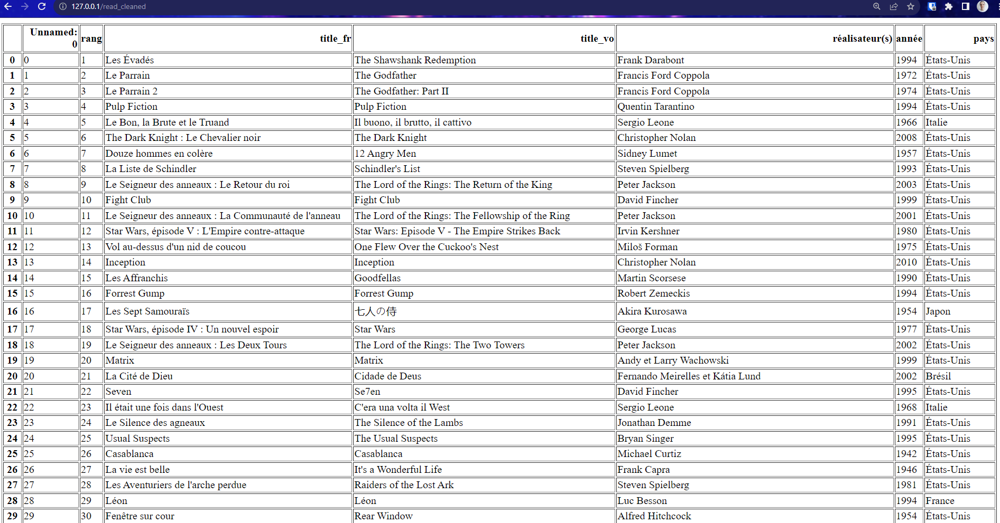

# Etapes pour la création du container :
    - création des fichiers "requirements.txt", "app.py", "process_data.py" et "Dockerfile"
# Le problème est de pouvoir executé les 2 scripts python dans un seul dockerfile, pour ce faire on va utiliser un "script.sh" qui va exécuter les 2 scripts pythons
    - Création du fichier "script.sh".
    - Modification du Dockerfile.
    - Build et run du container :
```bash
docker build -t img_1d
docker run -p 80:80 -v $pwd`:/usr/src/app img_1d
```

# Vérification:
```bash
 * Serving Flask app 'app'
 * Debug mode: off
WARNING: This is a development server. Do not use it in a production deployment. Use a production WSGI server instead.
 * Running on all addresses (0.0.0.0)
 * Running on http://127.0.0.1:80
 * Running on http://172.17.0.2:80
Press CTRL+C to quit
172.17.0.1 - - [01/Aug/2023 13:55:16] "GET /read_cleaned HTTP/1.1" 200 -
```

